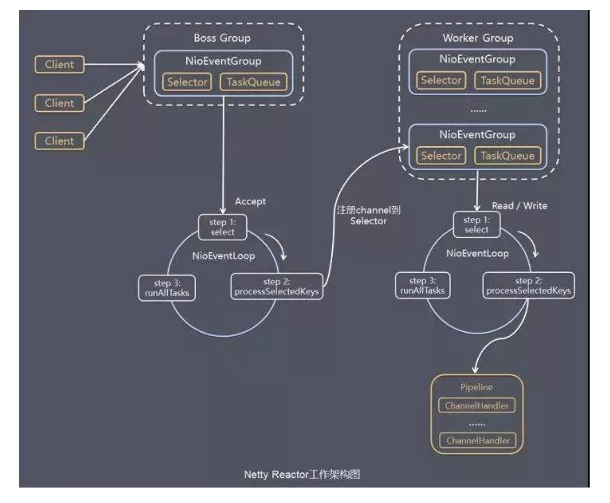
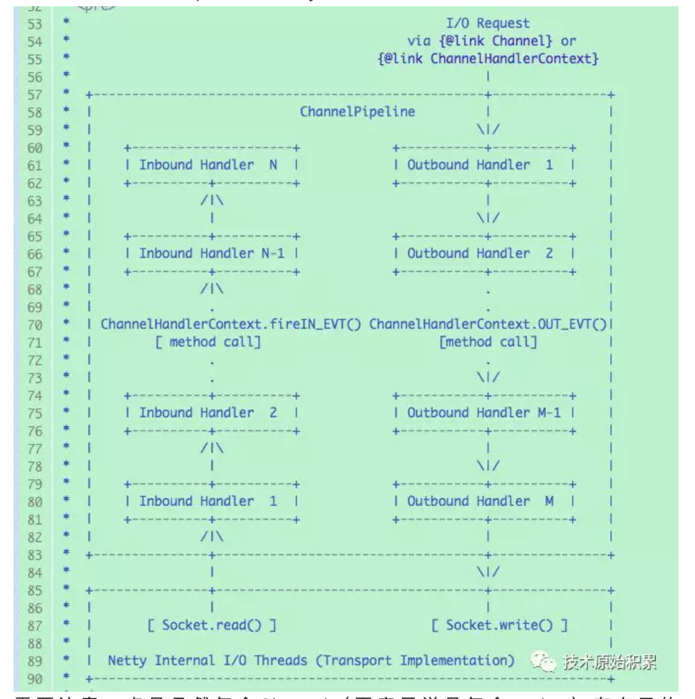
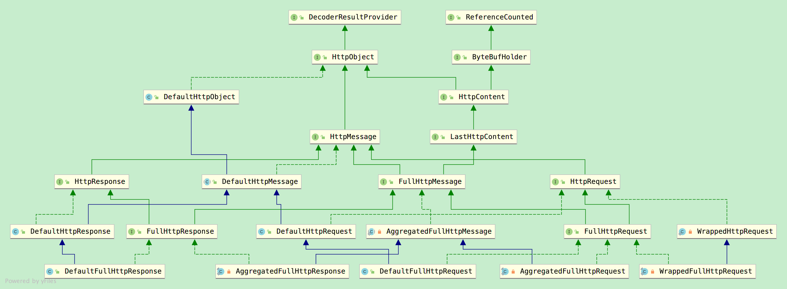

- [Netty介绍](#Netty介绍)
    - [Netty概述](#Netty概述)
    - [为什么使用Netty](#为什么使用Netty)
    - [Netty的特性与重要组件](#Netty的特性与重要组件)
    - [Netty常用类](#Netty常用类)
- [Netty实现原理](#Netty实现原理)
    - [Netty原理概述](#Netty原理概述)
    - [Netty执行流程](#Netty执行流程)
    - [ChannelPipeline的设计](#ChannelPipeline的设计)
    - [Netty高性能原因](#Netty高性能原因)
    - [Netty模型和NIO模型](#Netty模型和NIO模型)
    - [使用Handler的注意事项](#使用Handler的注意事项)
    - [Netty流控小技巧](#Netty流控小技巧)
    - [Netty线程模型](#Netty线程模型)
        - [Netty线程模型和JDK线程池TPE模型比较](#Netty线程模型和JDK线程池TPE模型比较)
        - [Reactor多线程模型的特点](#Reactor多线程模型的特点)
        - [Netty线程模型详解](#Netty线程模型详解)
        - [Netty中@Sharable创建ChannelHandler](#Netty中@Sharable创建ChannelHandler)
    - [Netty内存管理](#Netty内存管理)
        - [Netty内存管理（堆外内存池）](#Netty内存管理（堆外内存池）)
        - [ByteBuf分类](#ByteBuf分类)
        - [Netty零拷贝](#Netty零拷贝)
    - [Netty传输控制](#Netty传输控制)
        - [Java序列化和Hessian序列化的区别](#Java序列化和Hessian序列化的区别)
        - [TCP粘包/拆包与Netty解决方案](#TCP粘包/拆包与Netty解决方案)
        - [Netty的Selector模型](#Netty的Selector模型)
        - [Netty及NIO的epoll空轮询bug解决方案](#Netty及NIO的epoll空轮询bug解决方案)
    - [Netty协议](#Netty协议)
        - [Netty的HTTP协议数据](#Netty的HTTP协议数据)
    - [Netty内置ChannelHandler](#Netty内置ChannelHandler)
        - [IdleStateHandler](#IdleStateHandler)
- [参考资料](#参考资料)
    - [Netty官网](#Netty官网)
    - [Netty学习参考](#Netty学习参考)
    - [SpringBoot和Netty整合](#SpringBoot和Netty整合)


---------------------------------------------------------------------------------------------------------------------  
## Netty介绍

### Netty概述

官方的介绍：
```
Netty is an asynchronous event-driven network application framework for rapid development of maintainable high performance protocol servers & clients.
```

Netty是 一个异步事件驱动的网络应用程序框架，用于快速开发可维护的高性能协议服务器和客户端。


Netty Reactor工作架构图
   


参考 [Netty官网](#Netty官网)
  
  


### 为什么使用Netty


如果没有Netty？  
远古：java.net + java.io  
近代：java.nio  
其他：Mina，Grizzly  
  
  
NIO的缺点(为什么不用NIO呢)  
- NIO的类库和API繁杂，学习成本高，你需要熟练掌握Selector、ServerSocketChannel、SocketChannel、ByteBuffer等。
- 需要熟悉Java多线程编程。这是因为NIO编程涉及到Reactor模式，你必须对多线程和网络编程非常熟悉，才能写出高质量的NIO程序。
- 臭名昭著的epoll bug。它会导致Selector空轮询，最终导致CPU 100%。直到JDK1.7版本依然没得到根本性的解决。


Netty的优点：相对地，Netty的优点有很多：
- API使用简单，学习成本低。
- 功能强大，内置了多种解码编码器，支持多种协议。
- 性能高，对比其他主流的NIO框架，Netty的性能最优。
- 社区活跃，发现BUG会及时修复，迭代版本周期短，不断加入新的功能。
- Dubbo、Elasticsearch都采用了Netty，质量得到验证。  
  
  
  
### Netty的特性与重要组件


- taskQueue任务队列，如果Handler处理器有一些长时间的业务处理，可以交给taskQueue异步处理。
- scheduleTaskQueue延时任务队列，延时任务队列和上面介绍的任务队列非常相似，只是多了一个可延迟一定时间再执行的设置
- Future异步机制，ChannelFuture提供操作完成时一种异步通知的方式。一般在Socket编程中，等待响应结果都是同步阻塞的，而Netty则不会造成阻塞，因为ChannelFuture是采取类似观察者模式的形式进行获取结果。
- Bootstrap和ServerBootStrap是Netty提供的一个创建客户端和服务端启动器的工厂类，使用这个工厂类非常便利地创建启动类
- group()
    * bossGroup 用于监听客户端连接，专门负责与客户端创建连接，并把连接注册到workerGroup的Selector中。
    * workerGroup用于处理每一个连接发生的读写事件。
- channel()，这个方法用于设置通道类型，当建立连接后，会根据这个设置创建对应的Channel实例
    通道类型有以下：
    1. 异步非阻塞的
        * NioSocketChannel：异步非阻塞的客户端 TCP Socket 连接。
        * NioServerSocketChannel：异步非阻塞的服务器端 TCP Socket 连接。
    2. 阻塞的IO，几乎没什么人会选择使用Oio
        * OioSocketChannel：同步阻塞的客户端 TCP Socket 连接。
        * OioServerSocketChannel：同步阻塞的服务器端 TCP Socket 连接。
    3. 只能在linux环境下才可以启动
        * NioSctpChannel：异步的客户端 Sctp（Stream Control Transmission Protocol，流控制传输协议）连接。
        * NioSctpServerChannel：异步的 Sctp 服务器端连接。
- option()与childOption()
    * option()设置的是服务端用于接收进来的连接，也就是boosGroup线程。
    * childOption()是提供给父管道接收到的连接，也就是workerGroup线程。
    
    SocketChannel参数，也就是childOption()常用的参数：
    ```
    SO_RCVBUF      Socket参数，TCP数据接收缓冲区大小。
    TCP_NODELAY      TCP参数，立即发送数据，默认值为Ture。
    SO_KEEPALIVE      Socket参数，连接保活，默认值为False。启用该功能时，TCP会主动探测空闲连接的有效性。
    ```
  
    ServerSocketChannel参数，也就是option()常用参数：
    ```
    SO_BACKLOG Socket参数，服务端接受连接的队列长度，如果队列已满，客户端连接将被拒绝。默认值，Windows为200，其他为128。
    ```
- ChannelPipeline，设置流水线(重点)
    ChannelPipeline是Netty处理请求的责任链，ChannelHandler则是具体处理请求的处理器。实际上每一个channel都有一个处理器的流水线。  
    在Bootstrap中childHandler()方法需要初始化通道，实例化一个ChannelInitializer，这时候需要重写initChannel()初始化通道的方法，装配流水线就是在这个地方进行。
    
    处理器Handler主要分为两种：
        ChannelInboundHandlerAdapter(入站处理器)、ChannelOutboundHandler(出站处理器)
    
    入站指的是数据从底层java NIO Channel到Netty的Channel。  
    出站指的是通过Netty的Channel来操作底层的java NIO Channel。
    
    ChannelInboundHandlerAdapter处理器常用的事件有：参考 [Netty模型和NIO模型](#Netty模型和NIO模型)  
    ChannelOutboundHandler处理器常用的事件有：参考 [Netty模型和NIO模型](#Netty模型和NIO模型)  
    
    还有一个类似的handler()，主要用于装配parent通道，也就是bossGroup线程。一般情况下，都用不上这个方法。
- bind()  
      提供用于服务端或者客户端绑定服务器地址和端口号，默认是异步启动。如果加上sync()方法则是同步。  
      有五个同名的重载方法，作用都是用于绑定地址端口号。
- 优雅地关闭EventLoopGroup  
      //释放掉所有的资源，包括创建的线程  
      bossGroup.shutdownGracefully();  
      workerGroup.shutdownGracefully();   
      会关闭所有的child Channel。关闭之后，释放掉底层的资源。
- Channel  
    一种连接到网络套接字或能进行读、写、连接和绑定等I/O操作的组件。
- 获取channel的状态  
  boolean isOpen(); //如果通道打开，则返回true  
  boolean isRegistered();//如果通道注册到EventLoop，则返回true  
  boolean isActive();//如果通道处于活动状态并且已连接，则返回true  
  boolean isWritable();//当且仅当I/O线程将立即执行请求的写入操作时，返回true。  
  以上就是获取channel的四种状态的方法。
- 获取channel的配置参数  
    获取单条配置信息，使用getOption()
    获取多条配置信息，使用getOptions()
- Selector  
    在NioEventLoop中，有一个成员变量selector，这是nio包的Selector  
    Netty中的Selector也和NIO的Selector是一样的，就是用于监听事件，管理注册到Selector中的channel，实现多路复用器。  
- PiPeline与ChannelPipeline
  在前面介绍Channel时，我们知道可以在channel中装配ChannelHandler流水线处理器，那一个channel不可能只有一个channelHandler处理器，肯定是有很多的，既然是很多channelHandler在一个流水线工作，肯定是有顺序的。
  
  于是pipeline就出现了，pipeline相当于处理器的容器。初始化channel时，把channelHandler按顺序装在pipeline中，就可以实现按序执行channelHandler了。
  
  在一个Channel中，只有一个ChannelPipeline。该pipeline在Channel被创建的时候创建。ChannelPipeline包含了一个ChannelHander形成的列表，且所有ChannelHandler都会注册到ChannelPipeline中。
  
- ChannelHandlerContext  
    Netty设计了这个ChannelHandlerContext上下文对象，就可以拿到channel、pipeline等对象，就可以进行读写等操作。  
    通过类图，ChannelHandlerContext是一个接口，下面有三个实现类。  
    实际上ChannelHandlerContext在pipeline中是一个链表的形式。
- EventLoopGroup  
    其中包括了常用的实现类NioEventLoopGroup。OioEventLoopGroup在前面的例子中也有使用过。  
    每个EventLoopGroup里包括一个或多个EventLoop，每个EventLoop中维护一个Selector实例和TaskQueue实例  
    
    轮询机制的实现原理：  
    DefaultEventExecutorChooserFactory的源码，里面是轮询，它这里还有一个判断，如果线程数不是2的N次方，则采用取模算法实现。  


### Netty常用类

netty3.0：org.jboss.netty  
netty4.0：io.netty  

group、channel、handler、option  
  
客户端：  
Bootstrap  
NioEventLoopGroup  
NioSocketChannel  
Bootstrap.connect(host, port).sync()  
  
服务端：  
ServerBootstrap  
Boss和worker：EpollEventLoopGroup 或者 NioEventLoopGroup  
EpollServerSocketChannel 或者 NioServerSocketChannel   
ServerBootstrap.bind(portNumber).sync()  
  
  
netty定义了两种类型的线程  
I/O线程: EventLoop, EventLoopGroup。  
业务线程: EventExecutor, EventExecutorGroup。  
  
每个EventLoop和EventExecutor是一个单独的线程，可以执行Runnable任务。  
是SingleThreadEventLoop和SingleThreadEventExecutor  
  
  
ChannelInboundHandlerAdapter（Channel-Handler-Adapter）  
SimpleChannelInboundHandler（Channel-Handler,in-handler,out-handler）  
  
ChannelOutboundHandlerAdapter  
  
  
ChannelOption选项参考  
https://www.jianshu.com/p/975b30171352  
  
ChannelOption和套接字选项中对应  
  
ChannelOption.SO_KEEPALIVE  
ChannelOption.TCP_NODELAY  
ChannelOption.CONNECT_TIMEOUT_MILLIS  
ChannelOption.SO_SNDBUF和ChannelOption.SO_RCVBUF  
  
.option(ChannelOption.SO_BACKLOG, 1024)   backlog参数指定了队列的大小  
.option(ChannelOption.SO_REUSEADDR, true)  这个参数表示允许重复使用本地地址和端口，  
.option(ChannelOption.SO_KEEPALIVE, false)  当设置该选项以后，如果在两小时内没有数据的通信时，TCP会自动发送一个活动探测数据报文。  
.childOption(ChannelOption.TCP_NODELAY, true)     该参数的作用就是禁止使用Nagle算法，使用于小数据即时传输  
.childOption(ChannelOption.SO_SNDBUF, nettyServerConfig.getServerSocketSndBufSize())   
.childOption(ChannelOption.SO_RCVBUF, nettyServerConfig.getServerSocketRcvBufSize())    
这两个参数用于操作接收缓冲区和发送缓冲区的大小，接收缓冲区用于保存网络协议站内收到的数据，直到应用程序读取成功，发送缓冲区用于保存发送数据，直到发送成功。  


- NioSocketChannel
客户端套接字通道，内部管理了一个Java NIO中的java.nio.channels.SocketChannel实例，用来创建SocketChannel实例和设置该实例的属性，并调用Connect方法向服务端发起TCP链接等。

- NioServerSocketChannel
服务器端监听套接字通道，内部管理了一个Java NIO中的java.nio.channels.ServerSocketChannel实例，用来创建ServerSocketChannel实例和设置该实例属性，并调用该实例的bind方法在指定端口监听客户端的链接。

- Channel与socket的关系
在Netty中Channel有两种，对应客户端套接字通道NioSocketChannel，内部管理java.nio.channels.SocketChannel套接字，对应服务器端监听套接字通道NioServerSocketChannel，其内部管理自己的java.nio.channels.ServerSocketChannel套接字。也就是Channel是对socket的装饰或者门面，其封装了对socket的原子操作。

- EventLoopGroup
Netty之所以能提供高性能网络通讯，其中一个原因是因为它使用Reactor线程模型。在netty中每个EventLoopGroup本身是一个线程池，其中包含了自定义个数的NioEventLoop,每个NioEventLoop是一个线程，并且每个NioEventLoop里面持有自己的selector选择器。

在Netty中客户端持有一个EventLoopGroup用来处理网络IO操作，在服务器端持有两个EventLoopGroup，其中boss组是专门用来接收客户端发来的TCP链接请求的，worker组是专门用来具体处理完成三次握手的链接套接字的网络IO请求的。

- Channel 与 EventLoop 的关系
Netty中NioEventLoop是EventLoop的一个实现，每个NioEventLoop中会管理自己的一个selector选择器和监控选择器就绪事件的线程；每个Channel只会关联一个NioEventLoop；

当Channel是客户端通道NioSocketChannel时候，会注册NioSocketChannel管理的SocketChannel实例到自己关联的NioEventLoop的selector选择器上，然后NioEventLoop对应的线程会通过select命令监控感兴趣的网络读写事件；

当Channel是服务端通道NioServerSocketChannel时候，NioServerSocketChannel本身会被注册到boss EventLoopGroup里面的某一个NioEventLoop管理的selector选择器上，而完成三次握手的链接套接字是被注册到了worker EventLoopGroup里面的某一个NioEventLoop管理的selector选择器上；

需要注意是多个Channel可以注册到同一个NioEventLoop管理的selector选择器上，这时候NioEventLoop对应的单个线程就可以处理多个Channel的就绪事件；但是每个Channel只能注册到一个固定的NioEventLoop管理的selector选择器上。

- ChannelPipeline
  Netty中的ChannelPipeline类似于Tomcat容器中的Filter链，属于设计模式中的责任链模式，其中链上的每个节点就是一个ChannelHandler。在netty中每个Channel有属于自己的ChannelPipeline，对从Channel中读取或者要写入Channel中的数据进行依次处理,如下图是netty源码里面的一个图：
  
  需要注意一点是虽然每个Channel（更底层说是每个socket）有自己的ChannelPipeline，但是每个ChannelPipeline里面可以复用一个ChannelHandler。
  
   


  
  
  
---------------------------------------------------------------------------------------------------------------------  
## Netty实现原理

### Netty原理概述

Client客户端：NioSocketChannel（Java NIO中的java.nio.channels.SocketChannel实例）  
Server服务端：NioServerSocketChannel（Java NIO中的java.nio.channels.ServerSocketChannel实例）  
Channel是对socket的装饰或者门面，其封装了对socket的原子操作。  

每个EventLoopGroup（线程池）里包括一个或多个EventLoop（线程），每个EventLoop中维护一个Selector实例和TaskQueue示实例  
每个NioEventLoop是一个线程，并且每个NioEventLoop里面持有自己的selector选择器和TaskQueue示实例

每个Channel只会关联一个NioEventLoop  
多个Channel可以注册到同一个NioEventLoop管理的selector选择器上，这时候NioEventLoop对应的单个线程就可以处理多个Channel的就绪事件；  
但是每个Channel只能注册到一个固定的NioEventLoop管理的selector选择器上。  

一个Channel一生只会使用一个EventLoop（但是一个EventLoop可能会被指派用于服务多个Channel）  
Channel:EventLoop=N:1  
EventLoop:Selector=1:1  


Server端Boss线程和worker线程比较：boss设置为1，监听端口的  
Netty的高性能及NIO的epoll空轮询bug：判定和解决：重建selector  
TCP粘包/拆包与Netty解决方案：4种：分隔符，回车换行分隔符，定长报文，消息头和消息体  
netty的网络创建在哪里  
java nio的selector  和linux的epoll select  
  
Java异步NIO框架Netty实现高性能高并发：  
线程：高效的Reactor线程模型、线程池、无锁化的串行设计理念：Netty的NioEventLoop是单线程的  
内存：内存零拷贝、内存池化，各种不同大小对象管理：三种大小对象类型  
传输：异步非阻塞通信、零拷贝（直接内存和transferTo）、灵活的TCP参数配置能力（option参数的设置）  
协议：多种序列化协议，Protobuf的支持、Thrift的  


  
  
netty的相关所有，使用的协议  
hession用来干嘛的：Hessian本身即是基于Http的RPC实现  
Java序列化和Hessian序列化的区别  
netty的相关，管道是什么设计模式：责任链模式 或者 管道设计模式  
读写空闲检测、心跳机制、WebSocket 长连接，网关里面的hander是做什么用的


### Netty执行流程：  

拆包、解码、封装对象
  
ChannelInitializer中的每个SocketChannel都有一个管道pipeline，保存我们之前注册的handler，组成一个链表，ChannelHandlerContext包装hander类  
当有请求到来就执行链表的ChannelHandlerContext（内有我们定义的hander类）  
  
  
接受连接----->创建一个新的NioSocketChannel到list----------->循环注册到一个 worker EventLoop 上-----清除list---> 注册selecot Read 事件。  
  
  
Netty 的服务器端的 acceptor 阶段, 没有使用到多线程, 因此上面的 主从多线程模型 在 Netty 的服务器端是不存在的.  
  
NioEventLoopGroup实际上就是个线程池  
NioEventLoopGroup在后台启动了n个NioEventLoop来处理Channel事件  
每一个NioEventLoop负责处理m个Channel  
NioEventLoopGroup从NioEventLoop数组里挨个取出NioEventLoop来处理Channel  
  
BossEventLoopGroup通常是一个单线程的EventLoop，EventLoop维护着一个注册了ServerSocketChannel的Selector实例，  
BossEventLoop不断轮询Selector将连接事件分离出来，通常是OP_ACCEPT事件，然后将accept得到的SocketChannel交给WorkEventLoopGroup，  
WorkerEventLoopGroup会由next选择其中一个EventLoopGroup来将这个SocketChannel注册到其维护的Selector并对其后续的IO事件进行持续的处理。  
  
在Reactor模式中BossEventLoopGroup主要是对多线程的扩展，而每个EventLoop的实现涵盖IO事件的分离，和分发(Dispatcher)。  
  
  
  
  
Server端Boss线程和worker线程比较：  
  
bossGroup线程组实际就是Acceptor线程池，负责处理客户端的TCP连接请求，如果系统只有一个服务端端口需要监听，则建议bossGroup线程组线程数设置为1。  
workerGroup是真正负责I/O读写操作的线程组，通过ServerBootstrap的group方法进行设置，用于后续的Channel绑定。默认是可用的CPU内核数 × 2。  
  
  
  
BossGroup和WorkerGroup都是NioEventLoopGroup，BossGroup用来处理nio的Accept，Worker处理nio的Read和Write事件  
  
在Netty的里面有一个Boss，他开了一家公司（开启一个服务端口）对外提供业务服务，它手下有一群做事情的workers。  
Boss一直对外宣传自己公司提供的业务，并且接受(accept)有需要的客户(client)，当一位客户找到Boss说需要他公司提供的业务，Boss便会为这位客户安排一个worker，这个worker全程为这位客户服务（read/write）。  
如果公司业务繁忙，一个worker可能会为多个客户进行服务。这就是Netty里面Boss和worker之间的关系。，  


### ChannelPipeline的设计  
  
链表管理的方法  
添加：addFirst, addLast, addAfter, addBefore。  
删除：removeFirst, removeLast, remove。  
替换：replace。  
查找：first, last, get。  
  
  
channelPiple负责为每个新添加的handler分配一个eventExecutor。  
如果你调用了带grop参数的方法添加handler ，channelPiple会从group中取出一个eventExecutor分配给这个handler, 这时handler中的回调方法会在这个eventExecutor线程中执行，  
否则channelPiple会把channel的eventLoop当成eventExecutor分配给这个handler，这时这个handler的回调方法会在eventLoop的线程中执行。  
  
这个两者有什么不同呢？  
如果没你没有给handler指定group，它将会和channel的I/O操作共享线程资源，它能得到多少线程资源取决于eventLoop的ioRatio属性的设置，执行时间过长的handler的回调方法会影响I/O操作。  
如果指定了group，handler的回调方法和channel的I/O操作将会被隔离到不同的线程中。在高并发情况下，强烈建议为不同功能的handler指定不同的group。  
  
每个channel实例在创建的时候，它自己负责创建一个channelPiple实例。  
随后这个channel会被注册到一个eventLoop中，eventLoop负责处理channel上触发的I/O事件，把I/O事件转换成对channel.unsafe方法的调用。  
unsafe负责做实际的I/O操作，根据需要调用channelPiple触发事件。channelPiple依次调用合适的handler处理事件。  
  
这里的"依次”和“合适”的含义是:  
如果是inbound事件，会从头到尾按顺序调用双向链表上的ChannelInboundHandler类型的handler。  
如果是outbound事件，会从尾到头按顺序调用双向链表上的ChannelOutboundHandler类型的handler。  
  
piplePile确保一个handler调用始终在一个唯一的eventExecutor中，这个eventExecutor可能是channel的eventLoop，也可能是从用户指定的eventExecutorGroup中分配到的一个executor。  
  
  
  
  
--------------------------------------------------------------------------------------------------------------------- 

### Netty高性能原因


IO 通信性能三原则
尽管影响 I/O 通信性能的因素非常多，但是从架构层面看主要有三个要素。
1. 传输：用什么样的通道将数据发送给对方。可以选择 BIO、NIO 或者 AIO，I/O 模型 在很大程度上决定了通信的性能；
2. 协议：采用什么样的通信协议，HTTP 等公有协议或者内部私有协议。协议的选择不同，性能也不同。相比于公有协议，内部私有协议的性能通常可以被设计得更优；
3. 线程模型：数据报如何读取？读取之后的编解码在哪个线程进行，编解码后的消息如何派发，Reactor 线程模型的不同，对性能的影响也非常大。


Java异步NIO框架Netty实现高性能高并发：  
线程：高效的Reactor线程模型、线程池、无锁化的串行设计理念：Netty的NioEventLoop是单线程的  
内存：内存零拷贝、内存池化，各种不同大小对象管理：三种大小对象类型  
传输：异步非阻塞通信、零拷贝（直接内存和transferTo）、灵活的TCP参数配置能力（option参数的设置）  
协议：多种序列化协议，Protobuf的支持、Thrift的  

  
  
  
高性能的三个主题  
1) 传输：用什么样的通道将数据发送给对方，BIO、NIO或者AIO，IO模型在很大程度上决定了框架的性能。  
2) 协议：采用什么样的通信协议，HTTP或者内部私有协议。协议的选择不同，性能模型也不同。相比于公有协议，内部私有协议的性能通常可以被设计的更优。  
3) 线程：数据报如何读取？读取之后的编解码在哪个线程进行，编解码后的消息如何派发，Reactor线程模型的不同，对性能的影响也非常大。  
  
Netty高性能之道：  
2.2.1. 异步非阻塞通信：多路复用器Selector，读写操作都是非阻塞的，由于Netty采用了异步通信模式，一个IO线程可以并发处理N个客户端连接和读写操作，这从根本上解决了传统同步阻塞IO一连接一线程模型，架构的性能、弹性伸缩能力和可靠性都得到了极大的提升。  
  
2.2.2. 零拷贝  
1) Netty的接收和发送ByteBuffer采用DIRECT BUFFERS，使用堆外直接内存进行Socket读写，不需要进行字节缓冲区的二次拷贝。  
2) Netty提供了组合Buffer对象CompositeByteBuf，可以聚合多个ByteBuffer对象，用户可以像操作一个Buffer那样方便的对组合Buffer进行操作，避免了传统通过内存拷贝的方式将几个小Buffer合并成一个大的Buffer。  
3) Netty的文件传输采用了transferTo方法，它可以直接将文件缓冲区的数据发送到目标Channel，避免了传统通过循环write方式导致的内存拷贝问题。  
  
2.2.3. 内存池  
随着JVM虚拟机和JIT即时编译技术的发展，对象的分配和回收是个非常轻量级的工作。  
但是对于缓冲区Buffer，情况却稍有不同，特别是对于堆外直接内存的分配和回收，是一件耗时的操作。为了尽量重用缓冲区，Netty提供了基于内存池的缓冲区重用机制。  
  
  
2.2.4. 高效的Reactor线程模型，下面三种都支持  
常用的Reactor线程模型有三种，分别如下：  
1) Reactor单线程模型；  
2) Reactor多线程模型；  
3) 主从Reactor多线程模型  
  
2.2.5. 无锁化的串行设计理念：Netty的NioEventLoop是单线程的  
Netty的NioEventLoop读取到消息之后，直接调用ChannelPipeline的fireChannelRead(Object msg)，只要用户不主动切换线程，一直会由NioEventLoop调用到用户的Handler，期间不进行线程切换，这种串行化处理方式避免了多线程操作导致的锁的竞争，从性能角度看是最优的。  
  
  每个NioEventLoop的Selector和TaskQueue也都是单独的，避免不必要的竞争，还能实现顺序消费的功能
  
2.2.6. 高效的并发编程  
  
Netty的高效并发编程主要体现在如下几点：  
1) volatile的大量、正确使用;  
2) CAS和原子类的广泛使用；  
3) 线程安全容器的使用；  
4) 通过读写锁提升并发性能。  
  
  
2.2.7. 高性能的序列化框架  
影响序列化性能的关键因素总结如下：  
1) 序列化后的码流大小（网络带宽的占用）；  
2) 序列化&反序列化的性能（CPU资源占用）；  
3) 是否支持跨语言（异构系统的对接和开发语言切换）。  
Netty默认提供了对Google Protobuf的支持，通过扩展Netty的编解码接口，用户可以实现其它的高性能序列化框架，例如Thrift的压缩二进制编解码框架。  
  
  
2.2.8. 灵活的TCP参数配置能力  
option参数的设置  


下面我们看看 Netty 的架构设计是如何实现高性能的。

1. 采用非阻塞的 NIO 类库，基于 Reactor 模式实现，解决了传统同步阻塞 IO 模式下一个服务端无法平滑地处理线性增长的客户端的问题。
2. TCP 接收和发送缓冲区使用直接内存代替堆内存，避免了内存复制，提升了 IO 读取和写入的性能。
3. 支持通过内存池的方式循环利用 ByteBuffer，避免了频繁创建和销毁 ByteBuffer 带来的性能损耗。
4. 可配置的 IO 线程数、TCP 参数等，为不同的用户场景提供定制化的调优参数，满足不同的性能场景。
5. 采用环形数组缓冲区实现无锁化并发编程，代替传统的线程安全容器或者锁。
6. 合理地使用线程安全容器、原子类等，提升系统的并发处理能力。
7. 关键资源的处理使用单线程串行化的方式，避免多线程并发访问带来的锁竞争和额外的 CPU 资源消耗问题。
8. 通过引用计数器及时地申请释放不再被引用的对象，细粒度的内存管理降低了 GC 的频率，减少了频繁 GC 带来的延时和 CPU 损耗。


参考  
https://blog.csdn.net/gaowenhui2008/article/details/55044704  
https://youzhixueyuan.com/netty-implementation-principle.html  
https://github.com/doocs/source-code-hunter/blob/master/docs/Netty/AdvancedFeaturesOfNetty/Netty%E9%AB%98%E6%80%A7%E8%83%BD%E4%B9%8B%E9%81%93.md  
https://github.com/doocs/source-code-hunter/blob/master/docs/Netty/AdvancedFeaturesOfNetty/Netty%E6%9E%B6%E6%9E%84%E8%AE%BE%E8%AE%A1.md  


---------------------------------------------------------------------------------------------------------------------  
### Netty模型和NIO模型


##### 同步、异步、阻塞、非阻塞

- Unix IO模型的语境下，同步和异步的区别在于数据拷贝阶段是否需要完全由操作系统处理；完全由操作系统处理则为异步，否则为同步。
- 阻塞和非阻塞操作是针对发起IO请求操作后是否有立刻返回一个标志信息而不让请求线程等待；立即返回一个标志后，应用程序不断循环获取操作是否完成的状态是为非阻塞，否则为同步。


##### 常见的四中IO模型

1. 同步阻塞 IO
   
   用户进程在发起一个 IO 操作以后，必须等待 IO 操作的完成，只有当真正完成了 IO 操作以后，用户进程才能运行。 Java 传统的 IO 模型属于此种方式。

2. 同步非阻塞 IO
   
   用户进程发起一个 IO 操作以后便可返回做其它事情，但是用户进程需要不断询问 IO 操作是否就绪，从而引入不必要的 CPU 资源浪费。其中目前 Java 的 NIO 就属于同步非阻塞 IO 。

3. 异步阻塞 IO
   
   应用发起一个 IO 操作以后，不等待内核 IO 操作的完成，等内核完成 IO 操作以后会通知应用程序，这其实就是同步和异步最关键的区别，同步必须等待或者主动的去询问 IO 是否完成；那么为什么说是阻塞的呢？因为此时是通过 select 系统调用来完成的，而 select 函数本身的实现方式是阻塞的，而采用 select 函数有个好处就是它可以同时监听多个文件句柄，从而提高系统的并发性。

4. 异步非阻塞 IO
   
   用户进程只需要发起一个 IO 操作然后立即返回，等 IO 操作真正的完成以后，应用程序会得到 IO 操作完成的通知，此时用户进程只需要对数据进行处理就好了，不需要进行实际的 IO 读写操作，因为真正的 IO 读取或者写入操作已经由内核完成了。


参考  
https://mp.weixin.qq.com/s/KJDrIPH_2cVSqrNln36r-g  


NIO的三个概念：channel、buffer、selector  
Linux的IO模型和区别：五种  
Netty中的：ByteBuf、Channel、ChannelHandler、ChannelPipeline、EventLoop、Bootstrap  
ChannelHandler 两种类型的传递，入站类型、出战类型，复合类型  
EventLoop、EventLoopGroup：线程模型  
  
EventLoopGroup负责管理和分配EventLoop（创建EventLoop和为每个新创建的Channel分配EventLoop），根据不同的传输类型，EventLoop的创建和分配方式也不同。  
例如，使用NIO传输类型，EventLoopGroup就会只使用较少的EventLoop（一个EventLoop服务于多个Channel），这是因为NIO基于I/O多路复用，一个线程可以处理多个连接，  
而如果使用的是OIO，那么新创建一个Channel（连接）就需要分配一个EventLoop（线程）。  
  
  
一个Channel一生只会使用一个EventLoop（但是一个EventLoop可能会被指派用于服务多个Channel）  
Channel:EventLoop=N:1  
EventLoop:Selector=1:1
  
链式调用  
  
在使用netty进行编程的时候，对于输入事件的处理，我们应该继承ChannelInboundHandlerAdapter类，而不是直接实现ChannelInboundHandler接口；  
反之对于输出事件，我们应该继承ChannelOutboundHandlerAdapter类。  
  
  
最后一个必须是ChannelInboundHandler，否则后面的ChannelOutboundHandler不能传递到  
  
  
  
netty 的channelhander 和adapterhander 种类:  
  
ChannelInitializer：用于在ChannelPipeline中安装一组自定义的ChannelHandler；  
  
出站、入站、出入站混合：  
ChannelInboundHandlerAdapter：处理入站事件，实现了ChannelInboundHandler中定义的所有方法，只负责传播事件，通过委托ChannelHandlerContext来完成；  
需注意ChannelInboundHandlerAdapter的ChannelRea方法处理完消息后不会自动释放消息，若需要自动释放消息可以使用SimpleChannelInboundHandler。  
  
ChannelOutboundHandlerAdapter：处理出站事件，实现了ChannelOutboundHandler中定义的所有方法，只负责传播事件，通过委托ChannelHandlerContext来完成。  
  
ChannelDuplexHandler：能同时处理入站事件和出站事件的Handler；  
  
SimpleChannelInboundHandler：消息处理完之后，能够自动释放消息的Handler。  
  
MessageToByteEncoder：编码器，负责将java对象转化为字节序列；  
ByteToMessageDecoder：解码器，负责将字节序列（如：ByteBuf）转化为java对象；  
  
  
IdleStateHandler  
CloseOnIdleStateHandler  
  
LoggingHandler  
CorsHandler  
  
LineBasedFrameDecoder 是回车换行解码器  
DelimiterBasedFrameDecoder 是分隔符解码器  
FixedLengthFrameDecoder 是固定长度解码器  
  
ObjectEncoder 是 Java 序列化编码器，它负责将实现 Serializable 接口的对象序列化为 byte []，然后写入到 ByteBuf 中用于消息的跨网络传输。  
  
StringDecoder  
StringEncoder  
  
HttpRequestDecoder  
HttpResponseEncoder  
  
DatagramPacketDecoder  
DatagramPacketEncoder  
  
netty编解码详解  
https://www.infoq.cn/article/netty-codec-framework-analyse  
  
  
  
  
入站事件通常由I/O线程触发，如TCP链路建立事件、链路关闭事件、读事件、异常通知事件等等，事件传播通过ChannelHandlerContext中定义的方法来实现。  
  
入站事件传播方法：  
ChannelHandlerContext.fireChannelRegistered()：channel注册事件  
ChannelHandlerContext.fireChannelActive()：TCP链路建立成功，channel激活事件  
ChannelHandlerContext.fireChannelRead(Object)：读事件  
ChannelHandlerContext.fireChannelReadComplete()：读操作完成通知事件  
ChannelHandlerContext.fireExceptionCaught(Throwable)：异常通知事件  
ChannelHandlerContext.fireUserEventTriggered(Object)：用户自定义事件  
ChannelHandlerContext.fireChannelWritabilityChanged()：channel可写状态变化通知事件  
ChannelHandlerContext.fireChannelInactive()：TCP连接关闭，链路不可用通知事件  
ChannelHandlerContext.fireChannelUnregistered()：channel取消注册事件  
出站事件通常由用户主动发起的网络I/O操作，如用户发起的连接操作、绑定操作，消息发送操作等。  


  
  
出站事件传播方法：  
ChannelHandlerContext.bind(SocketAddress, ChannelPromise)：绑定本地地址事件  
ChannelHandlerContext.connect(SocketAddress, SocketAddress, ChannelPromise)：连接服务端事件  
ChannelHandlerContext.write(Object, ChannelPromise)：发送事件  
ChannelHandlerContext.flush()：刷新事件  
ChannelHandlerContext.read()：读事件  
ChannelHandlerContext.disconnect(ChannelPromise)：断开连接事件  
ChannelHandlerContext.close(ChannelPromise)：关闭当前channel事件  
ChannelHandlerContext.deregister(ChannelPromise)：取消注册channel事件  
  
  
  
  
参考  
https://sylvanassun.github.io/2017/11/30/2017-11-30-netty_introduction/  
https://my.oschina.net/7001/blog/994219  
https://www.infoq.cn/article/netty-threading-model  
  

---------------------------------------------------------------------------------------------------------------------  
### 使用Handler的注意事项：  
  
1、ChannelInboundHandler之间的传递，通过调用 ctx.fireChannelRead(msg) 实现；调用ctx.write(msg) 将传递到ChannelOutboundHandler。  
  
2、ctx.write()方法执行后，需要调用flush()方法才能令它立即执行。  
  
3、ChannelOutboundHandler 在注册的时候需要放在最后一个ChannelInboundHandler之前，否则将无法传递到ChannelOutboundHandler。  
最后一个必须是ChannelInboundHandler，否则后面的ChannelOutboundHandler不能传递到  
如果中间一个InboundHandler直接返回，不往后传递，只有这个hander之前的outhander才会执行,如果最后一个是DuplexHandler，里面的outHander里面的write逻辑也不会执行  
  
————————————————  
版权声明：本文为CSDN博主「丨知耻而后勇丨」的原创文章，遵循 CC 4.0 BY-SA 版权协议，转载请附上原文出处链接及本声明。  
原文链接：https://blog.csdn.net/u013252773/article/details/21195593  


### Netty流控小技巧

在使用Netty的时候，无论是客户端还是服务端，如果消息发送过快，而对端读取速度较慢，则很容易在发送队列（ChannelOutboundBuffer）积压，进而导致内存溢出。

除了应用层流控之外，也可以在发送消息的时候，判断下Netty发送队列的积压情况, 代码如下 ：

//获取积压消息个数  
 ctx.channel().unsafe().outboundBuffer().size();  
//如果达到积压阈值，则进行流控。


虽说通过判断发送队列积压情况做流控很方便，但是这种方式存在如下两个问题：
1. 问题1：ctx.channel().unsafe().outboundBuffer().size()实际上计算的是上次flushed时，发送队列中积压的消息，如果每次调用ctx.write（）时都调用一次ctx.flush()，则ctx.channel().unsafe().outboundBuffer().size()是准确的，如果周期性执行或者批量发送，write和flush不是成对出现的，则通过该方法获取的积压消息个数不精确。
2. 问题2：无法计算积压消息的内存占用，因为不同业务消息编码之后的长度不确定，因此，无法计算积压消息的实际内存占用。


在Netty 4中，调用ctx.channel().unsafe().outboundBuffer().totalPendingWriteBytes()可以获取发送队列中尚未发送的消息总长度，它的值是实时精确的：  
获取到积压消息长度之后，就可以根据当前堆内存的使用情况进行动态流控。

令人遗憾的是Netty 5的ChannelOutboundBuffer 没有开放获取积压消息长度的接口，这个比较蛋疼，如果需要，自己可以实现一个ChannelOutboundBuffer Facade类，提供相关接口。  
当然，最简单暴力的方式就是直接修改源码...（这个不提倡，将来版本升级会比较麻烦）

参考  
/Users/yangzl/git/quickstart-remoting/quickstart-netty/src/main/java/org/quickstart/netty/v4x/hello2/FlowControlHandler.java


---------------------------------------------------------------------------------------------------------------------  

## Netty线程模型


### Reactor模式

Reactor模式一般翻译成"反应器模式"，也有人称为"分发者模式"。它是将客户端请求提交到一个或者多个服务处理程序的设计模式。工作原理是由一个线程来接收所有的请求，然后派发这些请求到相关的工作线程中。

基于Java，Doug Lea（Java并发包作者）提出了三种形式，单Reactor单线程，单Reactor多线程和多Reactor多线程。

在介绍三种Reactor模式前，先简单地说明三个角色：
1. Reactor：负责响应事件，将事件分发到绑定了对应事件的Handler，如果是连接事件，则分发到Acceptor。
2. Handler：事件处理器。负责执行对应事件对应的业务逻辑。
3. Acceptor：绑定了 connect 事件，当客户端发起connect请求时，Reactor会将accept事件分发给Acceptor处理。


##### 单Reactor单线程

工作流程：  
只有一个select循环接收请求，客户端（client）注册进来由Reactor接收注册事件，然后再由reactor分发（dispatch）出去，由下面的处理器（Handler）去处理。

单Reactor单线程的特点：  
单线程的问题实际上是很明显的。只要其中一个Handler方法阻塞了，那就会导致所有的client的Handler都被阻塞了，也会导致注册事件也无法处理，无法接收新的请求。所以这种模式用的比较少，因为不能充分利用到多核的资源。

这种模式仅仅只能处理Handler比较快速完成的场景。


##### 单Reactor多线程

工作流程：  
在多线程Reactor中，注册接收事件都是由Reactor来做，其它的计算，编解码由一个线程池来做。从图中可以看出工作线程是多线程的，监听注册事件的Reactor还是单线程。


单Reactor多线程的特点  
对比单线程Reactor模型，多线程Reactor模式在Handler读写处理时，交给工作线程池处理，不会导致Reactor无法执行，因为Reactor分发和Handler处理是分开的，能充分地利用资源。从而提升应用的性能。

缺点：Reactor只在主线程中运行，承担所有事件的监听和响应，如果短时间的高并发场景下，依然会造成性能瓶颈。


##### 多Reactor多线程

工作流程  
1、mainReactor负责监听客户端请求，专门处理新连接的建立，将建立好的连接注册到subReactor。  
2、subReactor 将分配的连接加入到队列进行监听，当有新的事件发生时，会调用连接相对应的Handler进行处理。


多Reactor多线程的特点  
mainReactor 主要是用来处理客户端请求连接建立的操作。subReactor主要做和建立起来的连接做数据交互和事件业务处理操作，每个subReactor一个线程来处理。

这样的模型使得每个模块更加专一，耦合度更低，能支持更高的并发量。许多框架也使用这种模式，比如接下来要讲的Netty框架就采用了这种模式。


Netty Reactor工作架构图
  

这个架构实际上跟多Reactor多线程模型比较像。

1、BossGroup相当于mainReactor，负责建立连接并且把连接注册到WorkGroup中。WorkGroup负责处理连接对应的读写事件。  

2、BossGroup和WorkGroup是两个线程池，里面有多个NioEventGroup(实际上是线程)，默认BossGroup和WorkGroup里的线程数是cpu核数的两倍（源码中有体现）。

3、每一个NioEventGroup都是一个无限循环，负责监听相对应的事件。4、Pipeline(通道)里包含多个ChannelHandler(业务处理)，按顺序执行。


参考  
https://mp.weixin.qq.com/mp/appmsgalbum?__biz=MzU1OTgzNTAzNQ==&action=getalbum&album_id=1445826382487207937&scene=173#wechat_redirect  
https://developer.aliyun.com/article/769587?utm_content=g_1000165559
https://mp.weixin.qq.com/s/PonYrfSAGVIhKjABo6yJbw  
  
  
### Netty线程模型和JDK线程池TPE模型比较：  
1、netty线程切换几率小，更高效：TPE使用共用的队列排队，在高并发环境下会导致BlockingQueue频繁的锁碰撞，进而导致大量线程切换开销，  
    MEG中由于队列是只有一个线程消费，BlockingQueue锁碰撞机会比TPE小很多，线程切换开销也比TPE小很多  
2、netty保证执行顺序：TPE任务执行没有顺序，取出任务交给线程执行，MEG中由于队列是只有一个线程消费，可以保证执行顺序和入队顺序一致，  
  如: 在Channel上先后触发了connect, read, close事件，如果业务上要求收到close事件后不再处理read事件, 如果执行先后顺序不能保证，很有可能执行不到read的业务。这种类似业务场景在基于TCP协议的服务器中很常见，这一点TPE不能支持，而MEG能够很好地支持这些对任务执行顺序有要求的场景。  


### Reactor多线程模型的特点：


常用的 Reactor 线程模型有三种，分别如下：
1. Reactor 单线程模型；Reactor 单线程模型，指的是所有的 I/O 操作都在同一个 NIO 线程上面完成，  
2. Reactor 多线程模型；Rector 多线程模型与单线程模型最大的区别就是有一组 NIO 线程 处理 I/O 操作  
3. 主从 Reactor 多线程模型。服务端用于接收客户端连接的不再是个单线程的连接处理 Acceptor，而是一个独立的 Acceptor 线程池。  


1）有专门一个 NIO 线程 -Acceptor 线程用于监听服务端，接收客户端的 TCP 连接请求；  
2）网络 IO 操作 - 读、写等由一个 NIO 线程池负责，线程池可以采用标准的 JDK 线程池实现，它包含一个任务队列和 N 个可用的线程，由这些 NIO 线程负责消息的读取、解码、编码和发送；  
3）1 个 NIO 线程可以同时处理 N 条链路，但是 1 个链路只对应 1 个 NIO 线程，防止发生并发操作问题。  


Netty系列之Netty线程模型
https://blog.csdn.net/weixin_39818173/article/category/8521660  
https://blog.csdn.net/xiaolang85/article/details/37873059  
https://blog.csdn.net/qq_28959087/article/details/86501141   


### Netty线程模型详解
netty是一个基于事件驱动的框架，它把事件分成两种类型：输入事件(inbound)和输出事件(outbound)， 整个框架都是围绕事件处理进行设计的，以下是netty的核心架构：  
  
EventLoopGroup: 在Channel上执行I/O的线程组，netty把这个线程组中的线程定义为I/O线程，后面会讲到，有些特定的事件必须在I/O线程中处理。  
EventExecutorGroup: 用来执行ChannelHandlerContext和ChannelHandler中回调方法的线程。  
在用户向ChannelPipeline中注册一个ChannelHanlder时，如果指定了一个EventExecutorGroup，那么它和它对应的ChannelHandlerContext都会在指定的EventExecutorGroup执行，否则，在Channel的EventLoopGroup中执行。  
  
  
  
netty的高并发能力很大程度上由它的线程模型决定的，netty定义了两种类型的线程：  
  
I/O线程: EventLoop, EventLoopGroup。  
一个EventLoopGroup包含多个EventLoop, 每个Channel会被注册到一个，一个EventLoop中, 一个EventLoop可以包含多个Channel。  
Channel的Unsafe实例的方法必须要在EventLoop中执行(netty中明确指明的不需要在I/O线程中执行的几个方法除外，前面的章节中有详细的讲解)。  
  
业务线程: EventExecutor, EventExecutorGroup。一个EventExecutorGroup包含多个EventExecutor。  
当用户向Channel的pipeline注册一个ChannelHandler时，可以指定一个EventExecutorGroup，这个ChannelHanndler的所有方法都会被放到EventExecutorGroup的中的一个EventExecutor中执行。   
当用户没有为这个ChannelHandler明确指定EventExecutorGroup时，这个ChannelHandler会被放到Channel所属的EventLoop中执行。  
  
  
  
netty线程模型和JDK线程池模型比较：  
  
为了方便描述，先定义几个简称  
ThreadPoolExecutor: TPE(JDK)
MultithreadEventExecutorGroup: MEG(Netty)
SingleThreadEventExecutor: STE(Netty)
  
接下来，对比一下TPE和MEG  
1、线程管理: 
2、任务排队:
3、任务提交和执行: 

  
1、线程管理: 
TPE负责管理线程，根据传入的参数，运行过程中动态调节线程数，它也可以让线程一直保持在一个稳定的数量。  
MEG不负责管理线程，它只负责创建指定数量的STE, 每个STE只维护一个线程，保证有且只有一个线程。  
  
2、任务排队: 
TPE维护一个所有线程共用的任务队列，所有线程都从同一队列中取任务。  
MEG没任务队列，它只负责把任务派发到一个STE, 默认的派发策略是轮询。每个STE维护一个私有的任务队列，STE会把任务放入私有的队列中排队，这队列只有STE维护的线程才能消费。  
  
3、任务提交和执行: 
TPE把任务当成无关联的独立任务执行，不保证任务的执行顺序和execute的调用顺序一致, TPE认为任务的顺序不重要。  
MEG提交任务的方式有两种,   
（1）直接调用MEG的execute方法提交任务，这个方式，和TPE一样，不关心任务的执行顺序；  
（2）先从MEG中取出一个STE，然后调用STE的excute，这种方式任务的执行顺序和execute调用顺序一致。  
  
性能: TPE使用共用的队列排队，在高并发环境下会导致BlockingQueue频繁的锁碰撞，进而导致大量线程切换开销，  
MEG中由于队列是只有一个线程消费，BlockingQueue锁碰撞机会比TPE小很多，线程切换开销也比TPE小很多，  
因此，可以得出结论，如果任务本身不会导致线程阻塞，MEG性能比TPE高, 否则MEG没有优势。  
   
  
到这里已经可以回答前面提出的问题了:   
MEG把任务当成事件来看待，每个事件和特定的Channel关联(这一点由EventLoopGroup接口体现, 它定义了一个register(Channel channel)方法),   
而一个特定Channel上触发的一系列事件，处理顺序和触发顺序必须要一致，  
如: 在Channel上先后触发了connect, read, close事件，如果业务上要求收到close事件后不再处理read事件,   
如果执行先后顺序不能保证，很有可能执行不到read的业务。这种类似业务场景在基于TCP协议的服务器中很常见，这一点TPE不能支持，而MEG能够很好地支持这些对任务执行顺序有要求的场景。  
这就是netty要另外设计自己的线程模型的主要原因。  
  
  
  

### Netty中@Sharable创建ChannelHandler

Channel（更底层说是每个 socket）有自己的 ChannelPipeline，每个 ChannelPipeline里面管理者一系列的ChannelHandler。

正常情况下每个 Channel自己的 ChannelPipeline管理的同一个ChannelHandler Class对象的实例都是直接new的一个新实例，也就是原型模式，而不是单例模式。

当我们启动Netty服务端时候，会设置childHander，这个childHander会当服务器接受到完成TCP三次握手链接的时候给当前完成握手的Channel通道创建一个ChannelPipeline，并且创建一个EchoServerHandler的实例加入到Channel通道的ChannelPipeline。也就是说服务器接受的所有Channel对应的ChannelPipeline里面管理者自己的EchoServerHandler实例，而不是同一个。

但是有时候我们却想让不同Channel对应的ChannelPipeline里面管理同一个EchoServerHandler实例，比如为了全局的一些统计信息，既然上面说当服务器接受到完成TCP三次握手链接的时候给当前完成握手的Channel通道创建一个ChannelPipeline，并且创建一个EchoServerHandler的实例加入到Channel通道的ChannelPipeline，那么我们创建一个单例的EchoServerHandler传递给childHandler是不是就可以了？  
会报错，具体检查的代码是DefaultChannelPipeline类的checkMultiplicity的checkMultiplicity方法

可知当添加到不同管线的是不同的实例时候，不同连接在检查时候h.added总是返回的false，所以不会抛出异常。当添加到不同管线的是同一个实例时候，由于是单例，所以第一个连接会把单例的对象的added设置为了true，所以其他连接检查时候发现没有添加@Sharable注解并且当前added为true则会抛出异常。


总结  
正常情况下同一个ChannelHandler,的不同的实例会被添加到不同的Channel管理的管线里面的，但是如果你需要全局统计一些信息，比如所有连接报错次数（exceptionCaught）等，这时候你可能需要使用单例的ChannelHandler，需要注意的是这时候ChannelHandler上需要添加@Sharable注解。


参考  
https://mp.weixin.qq.com/s/sta6qMG01Rm2ZIN5NUTfkg  


---------------------------------------------------------------------------------------------------------------------  

## Netty内存管理


### Netty内存管理（堆外内存池）  
  
  
  
通过堆外内存的方式，避免了频繁的GC，但是带来了另外一个问题堆外内存创建的效率十分的低，所以频繁创建堆外内存更加糟糕。  
基于上述原因，Netty最终设计了一个堆外内存池，申请了一大块内存空间，然后对这块内存空间提供管理接口，让应用层不需要关注内存操作，能够直接拿到相关数据。  
  
heap模式存在频繁的GC，direct模式如果频繁开辟缓存和销毁，性能更低，所以采取了Pool的方式管理direct。  
而实际上使用池的技术也需要标记已使用的，和未使用的区域，使用完成之后也需要进行释放。  
Netty采取了一种GC策略，引用计数法。有一个类引用了该Buffer，+1，release的时候-1。为0的时候就都不使用了，这个时候该区域就可以进行释放  
  
  
通过NIO传输数据时需要一个内存地址，并且在数据传输过程中这个地址不可发生变化。但是，GC为了减少内存碎片会压缩内存，也就是说对象的实际内存地址会发生变化，所以Java就引入了不受GC控制的堆外内存来进行IO操作。那么数据传输就变成了这样  
但是内存拷贝对性能有可能影响比较大，所以Java中可以绕开堆内存直接操作堆外内存，问题是创建堆外内存的速度比堆内存慢了10到20倍，为了解决这个问题Netty就做了内存池。  
  
  
  
  
内存池实现：  
1、内存的分配：  
  1、内存池采用了slab分配思路，内存被划分成多种不同大小的内存单元，在分配内存时根据使用者请求的内存大小进行计算，匹配最接近的内存单元。分为tiny、small、normall、Huge内存块  
  2、为了避免线程竞争，内存分配优先在线程内分配，在PoolThreadCache中定义了tinySubPageHeapCaches、smallSubPageHeapCaches、normalHeapCaches分别在线程内缓存tiny、small、normall内存块  
2、内存的回收  
    Netty采取了一种GC策略，引用计数法。有一个类引用了该Buffer，+1，release的时候-1。为0的时候就都不使用了，这个时候该区域就可以进行释放
3、内存的碎片整理  
  
  
池化的简单实现思路，是基于JVM堆内存之上，构建更高一层内存池，通过调用内存池allocate方法获取内存空间，调用release方法将内存区域归还内存池。  
内存池面临的首要问题是碎片回收，内存池在频繁申请和释放空间后，还能有尽可能连续的内存空间用于大块内存空间的分配。  
基于这个需求，有两种算法用于优化这一块的内存分配：伙伴系统和slab系统。  
  
  
伙伴系统是以类完全二叉树的结构组织内存区域，左右节点互为伙伴。内存分配过程中，大块内存不断二分，直到找到满足所需的最小内存分片。  
内存释放是，判断释放内存分片的伙伴是否空闲，如果空闲则将左右伙伴合成更大一级内存块。  
linux就是使用该方式解决外部分配碎片的问题，为避免分片太细碎，通常情况下有最小分片，例如4k。  
  
slab系统：  
slab系统主要解决内部碎片问题，slab系统的思路是将预先申请的一块内存区域包装成一个内存集，该内存集将申请到的大块内存分割成相等大小的内存片。  
用户申请小块内存时，通过具体申请的内存大小找到slab系统中对应的一个内存集，从内存集中拿到内存分片，内存释放时也是将内存分片归还给内存集。  
  
  
netty4池化技术实现  
  
netty4相对于netty3的一大改进就是引入了内存池化技术，用以解决高速网络通信过程中，netty造成的应用内存锯齿状消费和大量gc的问题。  
这一块代码内容很多，逻辑略显复杂，但究其根本就是伙伴系统和slab系统的实现和扩展。  
内存池管理单元以Allocate对象的形式出现，一个Allocate对象由多个Arena组成，每个Arena能完全执行内存块的分配和回收。  
Arena内有三类内存块管理单元：TinySubPage,SmallSubPage,ChunkList。  
其中tiny和small符合slab系统的管理策略，ChunkList符合伙伴系统的管理策略。  
  
当用户申请内存介于tinySize和smallSize之间时，从tinySubPage中获取内存块；  
申请内存介于smallSize和pageSize之间时，从smallSubPage中获取内存块；  
介于pageSize和chunkSize之间时，从ChunkList中获取内存；  
大于ChunkSize的内存块不通过池化分配（其中tinySubPage和smallSubPage的内存也来自ChnkList，是对一个page内存块的细分）。  
  
除此之外，netty4中还有线程缓存的内存块和实现Recycler的对象重用，这些内容与池化无关，暂不赘述。  
java代码中可以使用netty4中的PooledByteBufAllocator对象实现内存池化效果。  
  
  
 可能存在的内存泄露问题：  
 1. 线程缓存问题  
   
 netty4中的池化buf，内存使用结束后首先将内存块归还给本地缓存，便于本地再次申请时直接从本地缓存获取，降低多线程对集中式内存分配器的并发压力，这时如果缓存分配跨线程就会出现问题。  
 例如线程A申请一块内存空间存放数据，这一块内存随后流转到线程B，线程B释放内存块，此时内存块被缓存在B线程中，  
 A再申请一块内存空间时，线程缓存中任然没有，而由于线程B从未申请内存，因此B中缓存的内存块永远不会被用到  
 （线程缓存中空闲内存块清理工作有allocate方法触发，因此B线程如果从不申请内存块则线程缓存永远不会被清理）  
   
 创建Allocator时有一个useCacheForAllThreads变量，用于控制缓存块是否被线程缓存，默认时开启的。如果内存块要在多个线程中流转，可以考虑关闭该变量，防止内存泄露。  
   
2. 死亡线程的内存块回收  
  
netty为了应对内存泄露的问题，在创建PoolThreadCache对象时，通过  
ThreadDeathWatcher.watch(deathWatchThread, freeTask);  
启用守护线程检测线程存活状态，随后每个PoolThreadCache对象创建时都会把当前线程注册进来。守护线程会每秒检测一次，判断线程死亡了则回收线程缓存中的内存块。  
  
3. 对象缓存  
  
netty4中的缓存池不仅缓存内存块，还缓存ByteBuf对象。  
  
例如allocate的一个PooledUnsafeHeapByteBuf对象，在release后会被暂存在RECYCLER中，再次allocate会将该对象重新分配使用，这样会造成之前已经release的对象重新变得可用。  
ByteBuf byteBuf = bufAllocator.buffer(100);  
byteBuf.release();  
ByteBuf byteBuf1 = bufAllocator.buffer(100);  
此时byteBuf会重新变得可用。  
  
4. 内存泄露检测  
  
当前有4个泄露检测级别：  
  ● 禁用（DISABLED）   - 完全禁止泄露检测。不推荐。  
  ● 简单（SIMPLE）       - 告诉我们取样的1%的缓冲是否发生了泄露。默认。  
  ● 高级（ADVANCED） - 告诉我们取样的1%的缓冲发生泄露的地方  
  ● 偏执（PARANOID）  - 跟高级选项类似，但此选项检测所有缓冲，而不仅仅是取样的那1%。此选项在自动测试阶段很有用。如果构建（build）输出包含了LEAK，可认为构建失败。  
使用 -Dio.netty.leakDetectionLevel=advanced 配置  
  
   
   
参考  
https://sq.163yun.com/blog/article/213832853624152064  
https://www.jianshu.com/p/7882689e7fe5  
https://www.jianshu.com/p/c4bd37a3555b  
https://blog.csdn.net/pentiumchen/article/details/45372625  
https://blog.csdn.net/TheLudlows/article/details/86144788  
http://blog.jobbole.com/106344/  
http://www.importnew.com/22205.html  
https://blog.csdn.net/chengzhang1989/article/details/80424556  
  
 
  


### ByteBuf分类

ByteBuf对象管理，主要从以下方面进行分类：Unpooled和Pooled
- Unpooled，非池化内存每次分配时直接调用系统 API 向操作系统申请ByteBuf需要的同样大小内存，用完后通过系统调用进行释放
- Pooled，池化内存分配时基于预分配的一整块大内存，取其中的部分封装成ByteBuf提供使用，用完后回收到内存池中

    Netty4默认使用Pooled的方式，可通过参数-Dio.netty.allocator.type=unpooled或pooled进行设置
    
Heap 和 DirectHeap
- Heap，指ByteBuf关联的内存JVM堆内分配，分配的内存受GC 管理
- Direct，指ByteBuf关联的内存在JVM堆外分配，分配的内存不受GC管理，需要通过系统调用实现申请和释放，底层基于Java NIO的DirectByteBuffer对象
    使用堆外内存的优势在于，Java进行I/O操作时，需要传入数据所在缓冲区起始地址和长度，由于GC的存在，对象在堆中的位置往往会发生移动，导致对象地址变化，系统调用出错
    
    为避免这种情况，当基于堆内存进行I/O系统调用时，需要将内存拷贝到堆外，而直接基于堆外内存进行I/O操作的话，可以节省该拷贝成本
    

##### 池化(Pooled)对象管理

问题
- 内存池管理算法是如何实现高效内存分配释放，减少内存碎片
- 高负载下内存池不断申请/释放，如何实现弹性伸缩
- 内存池作为全局数据，在多线程环境下如何减少锁竞争


参考  
https://mp.weixin.qq.com/s/ucde30LdnK17iSaIJw4nzg
https://ifeve.com/%e7%9c%8b%e5%ae%8c%e8%bf%99%e7%af%87%e8%bf%98%e4%b8%8d%e6%b8%85%e6%a5%9anetty%e7%9a%84%e5%86%85%e5%ad%98%e7%ae%a1%e7%90%86%ef%bc%8c%e9%82%a3%e6%88%91%e5%b0%b1%e5%93%ad%e4%ba%86%ef%bc%81/  


### Netty零拷贝：  
  
OS层面零拷贝  
netty层面零拷贝  

Netty的零拷贝体现在三个方面：

1. Netty的接收和发送ByteBuffer采用DIRECT BUFFERS，使用堆外直接内存进行Socket读写，不需要进行字节缓冲区的二次拷贝。如果使用传统的堆内存（HEAP BUFFERS）进行Socket读写，JVM会将堆内存Buffer拷贝一份到直接内存中，然后才写入Socket中。相比于堆外直接内存，消息在发送过程中多了一次缓冲区的内存拷贝。

2. Netty提供了组合Buffer对象，可以聚合多个ByteBuffer对象，用户可以像操作一个Buffer那样方便的对组合Buffer进行操作，避免了传统通过内存拷贝的方式将几个小Buffer合并成一个大的Buffer。

3. Netty的文件传输采用了transferTo方法，它可以直接将文件缓冲区的数据发送到目标Channel，避免了传统通过循环write方式导致的内存拷贝问题。


  
即所谓的 Zero-copy, 就是在操作数据时, 不需要将数据 buffer 从一个内存区域拷贝到另一个内存区域. 因为少了一次内存的拷贝, 因此 CPU 的效率就得到的提升.  
  
在 OS 层面上的 Zero-copy 通常指避免在 用户态(User-space) 与 内核态(Kernel-space) 之间来回拷贝数据.   
例如 Linux 提供的 mmap 系统调用, 它可以将一段用户空间内存映射到内核空间, 当映射成功后, 用户对这段内存区域的修改可以直接反映到内核空间;   
同样地, 内核空间对这段区域的修改也直接反映用户空间. 正因为有这样的映射关系, 我们就不需要在 用户态(User-space) 与 内核态(Kernel-space) 之间拷贝数据, 提高了数据传输的效率.  
  
而需要注意的是, Netty 中的 Zero-copy 与上面我们所提到到 OS 层面上的 Zero-copy 不太一样, Netty的 Zero-coyp 完全是在用户态(Java 层面)的, 它的 Zero-copy 的更多的是偏向于 优化数据操作 这样的概念.  
  
Netty 的 Zero-copy 体现在如下几个个方面:合并、分解、包装、tranferTo传输  
1、Netty 提供了 CompositeByteBuf 类, 它可以将多个 ByteBuf 合并为一个逻辑上的 ByteBuf, 避免了各个 ByteBuf 之间的拷贝.  
2、通过 wrap 操作, 我们可以将 byte[] 数组、ByteBuf、ByteBuffer等包装成一个 Netty ByteBuf 对象, 进而避免了拷贝操作.  
3、ByteBuf 支持 slice 操作, 因此可以将 ByteBuf 分解为多个共享同一个存储区域的 ByteBuf, 避免了内存的拷贝.  
4、通过 FileRegion 包装的FileChannel.tranferTo 实现文件传输, 可以直接将文件缓冲区的数据发送到目标 Channel, 避免了传统通过循环 write 方式导致的内存拷贝问题.  


参考
https://segmentfault.com/a/1190000007560884

https://www.cnblogs.com/xys1228/p/6088805.html  
https://blog.csdn.net/baiye_xing/article/details/73351252  
http://www.pianshen.com/article/5394293329/  


---------------------------------------------------------------------------------------------------------------------  

## Netty传输控制


  
### Java序列化和Hessian序列化的区别  
  
Hessian本身即是基于Http的RPC实现  
  
  
  
在远程调用中，需要把参数和返回值通过网络传输，这个使用就要用到序列化将对象转变成字节流，从一端到另一端之后再反序列化回来变成对象。这里就简单讲讲Java序列化和hessian序列化的区别。  
  
首先，hessian序列化比Java序列化高效很多，而且生成的字节流也要短很多。但相对来说没有Java序列化可靠，而且也不如Java序列化支持的全面。而之所以会出现这样的区别，则要从它们的实现方式来看。  
  
先说Java序列化，具体工作原理就不说了，Java序列化会把要序列化的对象类的元数据和业务数据全部序列化成字节流，而且是把整个继承关系上的东西全部序列化了。  
它序列化出来的字节流是对那个对象结构到内容的完全描述，包含所有的信息，因此效率较低而且字节流比较大。但是由于确实是序列化了所有内容，所以可以说什么都可以传输，因此也更可用和可靠。  
  
而Hessian序列化，它的实现机制是着重于数据，附带简单的类型信息的方法。  
就像Integer a = 1，hessian会序列化成I 1这样的流，I表示int or Integer，1就是数据内容。  
而对于复杂对象，通过Java的反射机制，hessian把对象所有的属性当成一个Map来序列化，产生类似M className propertyName1 I 1 propertyName S stringValue（大概如此，确切的忘了）这样的流，包含了基本的类型描述和数据内容。  
而在序列化过程中，如果一个对象之前出现过，hessian会直接插入一个R index这样的块来表示一个引用位置，从而省去再次序列化和反序列化的时间。  
这样做的代价就是hessian需要对不同的类型进行不同的处理（因此hessian直接偷懒不支持short），而且遇到某些特殊对象还要做特殊的处理（比如StackTraceElement）。  
而且同时因为并没有深入到实现内部去进行序列化，所以在某些场合会发生一定的不一致，比如通过Collections.synchronizedMap得到的map。  
  
  


---------------------------------------------------------------------------------------------------------------------  
  
### TCP粘包/拆包与Netty解决方案  


##### 什么是粘包和拆包
TCP是一种面向连接的、可靠的、基于字节流的传输层通信协议。(来自百度百科)

发送端为了将多个发给接收端的数据包，更有效地发送到接收端，会使用Nagle算法。  
Nagle算法会将多次时间间隔较小且数据量小的数据合并成一个大的数据块进行发送。  
虽然这样的确提高了效率，但是因为面向流通信，数据是无消息保护边界的，就会导致接收端难以分辨出完整的数据包了。

所谓的粘包和拆包问题，就是因为TCP消息无保护边界导致的。

TCP 底层并不了解上层（如 HTTP 协议）业务数据的具体含义，它会根据 TCP 缓冲区的实际情况进行包的划分，所以在业务上认为，一个完整的包可能会被 TCP 拆分成多个包进行发送，也有可能把多个小的包封装成一个大的数据包发送，这就是所谓的 TCP 粘包和拆包问题。


TCP 粘包/拆包发生的原因
问题产生的原因有三个，分别如下：
1. 应用程序 write 写入的字节大小 超出了 套接口发送缓冲区大小；
2. 进行 MSS 大小的 TCP 分段；
3. 以太网帧的 payload 大于 MTU 进行 IP 分片。


  
##### 粘包问题的解决策略  
  
由于底层的TCP无法理解上层的业务数据，所以在底层是无法保证数据包不被拆分和重组的，这个问题只能通过上层的应用协议栈设计来解决，根据业界的主流协议的解决方案，可以归纳如下。  
(1) 消息定长，规定报文的长度，例如每个报文的大小为固定长度200字节，如果不够，空位补空格；读取时按规定好的长度来读取。  
(2) 在数据的末尾添加特殊的符号标识数据包的边界。通常会加\n\r、\t或者其他的符号。在包尾增加回车换行符进行分割，例如FTP协议；  
(3) 将消息分为消息头和消息体，消息头中包含表示消息总长度(或者消息体长度)的字段，通常设计思路为消息头的第一个字段使用int32来表示消息的总长度；在数据的头部声明数据的长度，按长度获取数据。  
(4) 更复杂的应用层协议。  


  
  
##### Netty半包解码器解决TCP粘包/拆包问题  
为了解决TCP粘包/拆包导致的半包读写问题，Netty默认提供了多种编解码器用于处理半包，使其解决TCP粘包问题变得非常容易，主要有：  
  
1. FixedLengthFrameDecoder（使用定长的报文来分包）  
2. DelimiterBasedFrameDecoder（添加特殊分隔符报文来分包，用户可以指定消息结束的分隔符，回车换行解码器实际上是一种特殊的  
    LineBasedFrameDecoder  回车换行解码器  
    LineBasedFrameDecoder 的工作原理是它依次遍历 ByteBuf 中的可读字节，判断看是否有 \n 或者 \r\n，如果有，就以此位置为结束位置，从可读索引到结束位置区间的字节就组成了一行。
    
    它是以换行符为结束标志的解码器，支持携带结束符或者不携带结束符两种解码方式，同时支持配置单行的最大长度。  
    
    如果连续读取到最大长度后仍然没有发现换行符，就会抛出异常，同时忽略掉之前读到的异常码流。
    
    StringDecoder 的功能非常简单，就是将接收到的对象转换成字符串，然后继续调用后面的 Handler。LineBasedFrameDecoder + StringDecoder 组合 就是按行切换的文本解码器，它被设计用来支持 TCP 的粘包和拆包。
    
3. LengthFieldBasedFrameDecoder  大多数的协议（私有或者公有），协议头中会携带长度字段，用于标识消息体或者整包消息的长度，例如SMPP、HTTP协议等。  

由于基于长度解码需求的通用性，以及为了降低用户的协议开发难度，Netty提供了LengthFieldBasedFrameDecoder，自动屏蔽TCP底层的拆包和粘包问题，只需要传入正确的参数，即可轻松解决“读半包“问题。  
  
  
  
Netty网络模型参考  
https://blog.csdn.net/hbtj_1216/article/details/75331995  
https://blog.csdn.net/j080624/article/details/87209637  
https://github.com/doocs/source-code-hunter/blob/master/docs/Netty/TCP%E7%B2%98%E6%8B%86%E5%8C%85/TCP%E7%B2%98%E6%8B%86%E5%8C%85%E9%97%AE%E9%A2%98%E5%8F%8ANetty%E4%B8%AD%E7%9A%84%E8%A7%A3%E5%86%B3%E6%96%B9%E6%A1%88.md  
    

---------------------------------------------------------------------------------------------------------------------  
### Netty的Selector模型


Java NIO的selector 和Linux的epoll select  
  
https://www.cnblogs.com/jukan/p/5272257.html  
http://blog.csdn.net/u010853261/article/details/53464475  
选择器的创建  
当调用Selector.open()时，选择器通过专门的工厂SelectorProvider来创建Selector的实现，SelectorProvider屏蔽了不同操作系统及版本创建实现的差异性。  
public static Selector open() throws IOException {  
    return SelectorProvider.provider().openSelector();  
}  
这里系统默认的provider在不同系统上是不一样的，在MacOSX上是默认的KQueueSelectorProvider  
因为SelectorProvider本身为一个抽象类，通过调用provider()提供对应的Provider实现，如PollSelectorProvider、EPollSelectorProvider  
这是linux操作系统下的DefaultSelectorProvider的实现，可以看到，如果内核版本>=2.6则，具体的SelectorProvider为EPollSelectorProvider，否则为默认的PollSelectorProvider  
结合上文，可以猜测一下EPollSelectorProvider提供的Selector肯定是与内核epoll有关的，PollSelectorProvider提供的Selector肯定是与poll有关的。  
  
linux下select/poll/epoll机制的比较  
https://www.cnblogs.com/zhaodahai/p/6831456.html  
FD：文件描述符（file descriptor）  
  
epoll的优点：  
1、没有最大并发连接的限制，能打开的FD的上限远大于1024（1G的内存上能监听约10万个端口）；  
2、效率提升，不是轮询的方式，不会随着FD数目的增加效率下降。只有活跃可用的FD才会调用callback函数；  
即Epoll最大的优点就在于它只管你“活跃”的连接，而跟连接总数无关，因此在实际的网络环境中，Epoll的效率就会远远高于select和poll。  
3、 内存拷贝，利用mmap()文件映射内存加速与内核空间的消息传递；即epoll使用mmap减少复制开销。  
  
  
http://blog.csdn.net/shallwake/article/details/5265287  
那么，为什么epoll,kqueue比select高级？   
答案是，他们无轮询。因为他们用callback取代了。  
  

---------------------------------------------------------------------------------------------------------------------  

  
### Netty及NIO的epoll空轮询bug解决方案  
  
  
Selector BUG出现的原因  
若Selector的轮询结果为空，也没有wakeup或新消息处理，则发生空轮询，CPU使用率100%，  
  
Netty的解决办法  
1、对Selector的select操作周期进行统计，每完成一次空的select操作进行一次计数，  
2、若在某个周期内连续发生N次空轮询，则触发了epoll死循环bug。  
3、重建Selector，判断是否是其他线程发起的重建请求，若不是则将原SocketChannel从旧的Selector上去除注册，重新注册到新的Selector上，并将原来的Selector关闭。  
  
Netty的解决策略：  
对Selector的select操作周期进行统计。  
每完成一次空的select操作进行一次计数。  
在某个周期内如果连续N次空轮询，则说明触发了JDK NIO的epoll死循环bug。  
创建新的Selector，将出现bug的Selector上的channel重新注册到新的Selector上。  
关闭bug的Selector，使用新的Selector进行替换。  


Netty的解决办法：对Selector的select操作周期进行统计，每完成一次空的select操作进行一次计数，若在某个周期内连续发生N次空轮询，则触发了epoll死循环bug。  
重建Selector，判断是否是其他线程发起的重建请求，若不是则将原SocketChannel从旧的Selector上去除注册，重新注册到新的Selector上，并将原来的Selector关闭。


参考  
https://www.cnblogs.com/JAYIT/p/8241634.html  
http://www.voidcn.com/article/p-rzokhbzl-zh.html  
https://blog.csdn.net/zhangjunli/article/details/89382006  
  
  


---------------------------------------------------------------------------------------------------------------------  

## Netty内置ChannelHandler


### IdleStateHandler  

IdleStateHandler心跳机制：
1. IdleStateHandler构造器：设置定时任务的各种时间参数
2. IdleStateHandler的channelActive()方法在socket通道建立时被触发：启动定时任务
3. 定时任务添加到对应线程EventLoopExecutor对应的任务队列taskQueue中，在对应线程的run()方法中循环执行
   
   用当前时间减去最后一次channelRead方法调用的时间判断是否空闲超时；
   
   如果空闲超时则创建空闲超时事件并传递到channelPipeline中；
4. 在管道中传递调用自定义的userEventTrigger()方法：自己可以实现一个ChannelHandler，实现userEventTrigger()方法  


代码实现:  
1. 添加IdleStateHandler到ChannelPipeline
2. 自定义ChannelHandler，实现userEventTrigger()方法 


代码实现参考  
https://github.com/youngzil/quickstart-spring-boot/tree/master/quickstart-spring-boot-netty-action  
https://github.com/youngzil/quickstart-spring-boot2/tree/master/quickstart-spring-netty-action  


参考  
https://blog.csdn.net/u013967175/article/details/78591810  
https://leokongwq.github.io/2017/02/28/java-netty-idleStateHandler.html  


---------------------------------------------------------------------------------------------------------------------  

## Netty协议


### Netty的HTTP协议数据

- HttpRequest（FullHttpRequest）  
- HttpContent（LastHttpContent、FullHttpMessage）  
- HttpResponse（FullHttpResponse）  




---------------------------------------------------------------------------------------------------------------------  
  
  
## 参考资料


### Netty官网

http://netty.io/  
https://github.com/netty/netty  
https://netty.io/4.1/api/index.html
  
  

### Netty学习参考


参考文章  
http://ifeve.com/netty1/  
[李林锋InfoQ博客](https://www.infoq.cn/profile/46034E8B91DB3A/publish)  


Java异步NIO框架Netty实现高性能高并发  
https://blog.csdn.net/gaowenhui2008/article/details/55044704  
https://blog.csdn.net/a724888/article/category/7744972   
https://github.com/code4craft/netty-learning  
https://crossoverjie.top/categories/Netty/  
https://github.com/crossoverJie/netty-learning  
https://github.com/doocs/source-code-hunter#Netty  
https://github.com/Snailclimb/netty-practical-tutorial/blob/master/README.md  
https://github.com/guang19/framework-learning#netty  
https://developer.aliyun.com/article/769813  


示例查看  
org.quickstart.remoting.netty.v4x.helloworld  
Rocketmq中的连接:NettyRemotingClient、NettyRemotingServer  


https://mp.weixin.qq.com/s/3bzjW4_GHMCK716XPLj98A  
https://snailclimb.gitee.io/javaguide-interview/#/./docs/e-4netty?id=_54-netty-%e9%9d%a2%e8%af%95%e9%a2%98%e6%80%bb%e7%bb%93  
 


### SpringBoot和Netty整合
https://crossoverjie.top/2018/05/24/netty/Netty(1)TCP-Heartbeat/  
https://github.com/duanwucui/netty-action  
https://github.com/youngzil/quickstart-spring-boot/tree/master/quickstart-spring-boot-netty-action  
https://github.com/youngzil/quickstart-spring-boot2/tree/master/quickstart-spring-netty-action  


---------------------------------------------------------------------------------------------------------------------  


